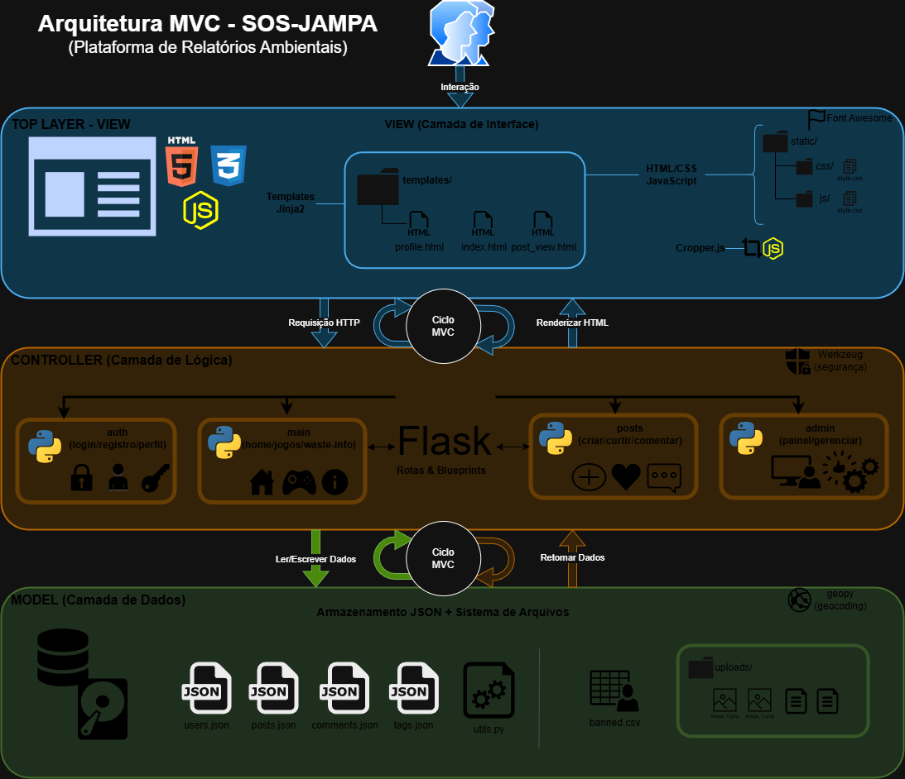

# SOS Jampa

   

> **Versão:** 1.0.0 (Beta)  
> **Instituição:** IFPB  
> **Atualização:** Fevereiro de 2026

Seja bem-vindo ao repositório do **SOS Jampa**! Este projeto nasceu de uma iniciativa interdisciplinar no IFPB com um objetivo claro: usar a tecnologia para cuidar da nossa cidade.

A ideia aqui não é ser apenas "mais um site", mas uma ferramenta real para conectar os cidadãos de João Pessoa com a sustentabilidade. Queremos facilitar denúncias de descarte irregular de lixo, ensinar sobre reciclagem de um jeito leve e ajudar as pessoas a encontrarem o ponto de coleta mais próximo.

---

## Como o sistema foi construído (Arquitetura)

Para manter o código organizado e fácil de entender, escolhemos a arquitetura **MVC (Model-View-Controller)** usando o framework **Flask** (Python). Se você está chegando agora no mundo do desenvolvimento, pense nisso como uma divisão de tarefas:

- **Model (Quem cuida dos dados)**:
  - Optamos por uma abordagem prática e leve: em vez de um banco de dados complexo, estamos usando arquivos **JSON** (na pasta `app/data/`). É simples, rápido e funciona super bem para o propósito do projeto.
- **View (O que você vê)**:
  - É a "cara" do site. Usamos templates HTML com **Jinja2** para deixar as páginas dinâmicas, e cada telinha tem seu próprio estilo CSS (`static/css/`) para garantir uma identidade visual bonita e organizada.
- **Controller (O cérebro)**:
  - É aqui que a mágica acontece. O Flask gerencia os pedidos dos usuários. Para não misturar as coisas, dividimos o sistema em **Blueprints** (módulos separados):
    - `auth`: Tudo que envolve login e cadastro.
    - `posts`: A lógica das denúncias e do feed.
    - `main`: As páginas principais e institucionais.
    - `admin`: A área restrita para gestão.

---

## Diagramas do Projeto

Para facilitar o entendimento visual da nossa estrutura, preparamos alguns diagramas (que estão salvos na pasta `Diagrama/`):

### Como as peças se encaixam (Arquitetura)



### O fluxo das ações (Casos de Uso)


---

## O que você pode fazer no sistema?

Pensamos na experiência de dois tipos de usuários:

### Para o Cidadão (Usuário Comum)

- **Crie seu espaço**: Faça seu cadastro e personalize seu perfil. Implementamos até uma ferramenta de recorte de fotos para seu avatar ficar perfeito!
- **Solte a voz**: Viu lixo onde não devia? Abra o **Feed de Denúncias**, poste uma foto, descreva o problema e ajude a comunidade.
- **Aprenda se divertindo**: Temos uma área de **Jogos Educativos** e informações claras sobre tipos de resíduos.
- **Ache fácil**: Precisa descartar algo específico? Nosso sistema ajuda a localizar os **Pontos de Coleta**.

### Para a Administração

- **Visão de Águia**: Um **Dashboard** administrativo para acompanhar as métricas e o engajamento da plataforma.
- **Controle**: Ferramentas para moderar postagens e usuários, garantindo que a comunidade continue saudável.

---

## Estrutura de Pastas

Se você for explorar o código, aqui está um guia rápido de onde encontrar cada coisa:

```plaintext
PROJETO-SOS-JAMPA/
│
├── app/                      # Onde todo o código fonte vive
│   ├── __init__.py           # Onde o Flask nasce (App Factory)
│   ├── utils.py              # Nossas ferramentas úteis (Uploads, etc)
│   │
│   ├── admin/                # Controle da área administrativa
│   ├── auth/                 # Controle de Login/Perfil
│   ├── main/                 # Controle das páginas centrais
│   ├── posts/                # Controle das postagens
│   │
│   ├── data/                 # Nossos "bancos de dados" em JSON
│   ├── static/               # Arquivos públicos (CSS, JS, Imagens)
│   │   ├── css/pages/        # Estilos separados por página (organização é tudo!)
│   │   ├── js/               # A interatividade do frontend
│   │   └── uploads/          # Onde as fotos dos usuários são salvas
│   │
│   └── templates/            # As páginas HTML (Jinja2)
│
├── Diagrama/                 # Documentação visual do projeto
├── requirements.txt          # Lista de ingredientes (libs Python)
└── run.py                    # O comando de partida!
```

---

## Quer rodar na sua máquina?

É super simples testar o projeto. Siga esses passos:

1. **Baixe o projeto:**

   ```bash
   # Clone o repositório ou baixe o ZIP e entre na pasta
   cd PROJETO-SOS-JAMPA
   ```

2. **Prepare o ambiente (recomendado):**

   ```bash
   # Crie um ambiente virtual para não bagunçar seu Python global
   # No Windows:
   python -m venv .venv
   .venv\Scripts\activate

   # No Linux/Mac:
   python3 -m venv .venv
   source .venv/bin/activate
   ```

3. **Instale o que precisa:**

   ```bash
   pip install -r requirements.txt
   ```

4. **Dê a partida:**

   ```bash
   python run.py
   ```

5. **Pronto!** Agora é só abrir seu navegador em:
   http://127.0.0.1:5000
